# Tales of Budapest — The App and Architecture in Simple Language

## What the app is

Tales of Budapest is a map-based historical guide.

A visitor can open the map, tap a Budapest building, and discover:

- what happened there;
- who lived or worked there;
- how the place changed over time;
- photographs and other historical media;
- an audio story;
- the book, archive, or page supporting each important claim.

The app can also build a walking tour from several landmarks. The user can
ask for a topic or mood, preview the route, and listen to a chapter at each
stop.

The important difference from a generic AI guide is that AI is not treated
as the source. Historical books, archives, directories, photographs, and
structured public data are the sources. AI helps turn those sources into
structured information and readable stories.

## The whole system in one picture

```mermaid
flowchart LR
  Sources["Books, archives, directories, photos, open data"]
  Private["Private corpus and extraction staging"]
  Match["Name, alias, address, location and vector matching"]
  Review["Automatic safety rules and human review"]
  Admin["Private admin: inspect, review and connect"]
  Graph["Canonical knowledge graph in PostgreSQL"]
  Safe["Safe Chronicle view"]
  App["Map, Chronicle, audio and walking tours"]

  Sources --> Private
  Private --> Match
  Match --> Review
  Review --> Admin
  Admin --> Graph
  Graph --> Safe
  Safe --> App
```

The left side is the research factory. The right side is the public product.
Raw books and model output stay on the research side.

## What users see

### The map

The main screen is a Budapest map with landmark pins. The app loads only the
pins needed for the visible area and zoom level, so the map stays fast even
when the database grows.

### A landmark

Tapping a landmark loads its full details. The landmark can contain an image,
an audio story, and a Chronicle.

The Chronicle is the structured history of that place:

- a timeline of facts and events;
- people connected to the location;
- relationships such as lived in, designed, owned, or performed at;
- compact source citations.

If a place has not been researched yet, the app shows an honest empty state
instead of inventing a story.

### Audio

Landmark audio is created on demand when no cached version exists. The system
builds a fact-grounded script, sends it to text-to-speech, stores the result,
and reuses it for later listeners.

Audio can vary by language and style, such as an easy version, a storyteller
version, or a deeper historian version.

### Custom walking tours

The user describes the kind of walk they want. The system selects suitable
landmarks, creates a walkable route, prepares a chapter for every stop, and
saves the finished tour.

The long-term rule is simple: generated stories may use only reviewed facts
provided by the knowledge graph.

## The main code areas

The repository is a monorepo: several connected applications live in one
project.

| Folder | Plain-language responsibility |
|---|---|
| `talesofbudapest-frontend/` | The map, player, Chronicle, settings, saved tours, and Next.js API routes |
| `talesofbudapest-admin/` | The private overview, Insights, review inbox, and graph explorer; it runs separately on port 3100 |
| `talesofbudapest-backend/` | Historical extraction, entity matching, promotion, story generation, audio generation, and database commands |
| `ingest/` | Collects and cleans open landmark data from sources such as Budapest100, Wikidata, Wikipedia, and monument sites |
| `supabase/migrations/` | Defines the PostgreSQL tables, indexes, security rules, vector search, and public views |
| `ingest/corpus/` | Local copies of books, page text, extraction JSON, caches, and reports; restricted material is ignored by Git |
| `infra/` | The self-hosted Supabase and Docker setup used for local development and later server hosting |
| `rag/` | An older general document-chunk retrieval path; useful, but separate from the canonical knowledge graph |
| `docs/` | Product strategy, licensing rules, pipeline instructions, decisions, and technical documentation |

## Where data lives

### PostgreSQL and Supabase

PostgreSQL is the main database. Supabase provides an API, file storage, and
security rules around it.

The project can use two separate databases:

- local Docker Supabase for development and large local imports;
- hosted Supabase for the deployed product.

These databases do not synchronize automatically. A script writes to the
database named in its environment settings.

### The original landmark table

`locations` contains the places shown on the map. It stores the display name,
coordinates, images, importance, source information, and existing story/audio
fields.

The knowledge graph does not replace this table. It adds deeper history around
the same mapped locations.

### Private staging tables

The first database destination for extracted historical material is private
staging:

- `kg_sources` describes the source and its license;
- `kg_pages` stores private page text and page references;
- `kg_mentions` stores one extraction result;
- `kg_locations`, `kg_people`, and `kg_events` store unresolved extracted
  items;
- `kg_organisations` stores extracted institutions, companies, congregations,
  associations, and other organisations;
- `kg_staged_relations` stores unresolved relationships.

The extraction model writes only to this side of the system. Staged data is
not automatically public.

### The canonical knowledge graph

After matching and review, useful information moves into canonical tables:

- `kg_entities` stores one accepted identity for a location, person, event,
  or organization;
- `kg_entity_aliases` stores different names, languages, historical names,
  addresses, and identifiers;
- `kg_claims` stores factual statements;
- `kg_edges` stores relationships between entities;
- `kg_evidence` stores the source and page supporting an entity, claim, or
  relationship.

Canonical records have two separate controls:

- review status: draft, needs review, approved, or rejected;
- publication status: private or public.

This separation matters. A correct identity can be approved for internal use
without publishing any historical content.

### The public Chronicle view

The frontend does not read raw knowledge-graph tables directly. It reads the
safe `kg_location_chronicle` view.

That view returns reviewed public facts, events, people, relationships, and
safe citations for one mapped location. It does not return raw page text,
verbatim restricted passages, extraction prompts, embeddings, or model data.

## How a book becomes useful app content

### 1. Get the source legally

Every source needs a recorded license decision. Public-domain and suitable
Creative Commons sources can move toward publication. Restricted material can
be researched privately, but it is never published by accident.

### 2. Turn the file into page text

Born-digital text and good PDF text layers are extracted directly. Scanned or
damaged pages use OCR or a vision model. Page boundaries are preserved so
every later claim can point back to a source page.

### 3. Extract structured information

The extraction model returns JSON containing locations, people, events,
facts, and relationships. Every item should include supporting evidence.

The current restricted-book p3 format keeps both:

- the name as written in the source;
- an English form for the app and matching pipeline.

It also records confidence and tourist interest for facts.

### 4. Load into private staging

The JSON is validated and imported idempotently. Running the importer twice
should not create duplicate windows or pages.

### 5. Match extracted places to map landmarks

Matching uses several independent signals:

1. normalized names;
2. approved aliases and historical names;
3. Hungarian and English name equivalents;
4. addresses, districts, and house numbers;
5. geographic distance when coordinates exist;
6. vector similarity as a shortlist helper.

The shared normalizer removes harmless differences such as accents,
punctuation, district prefixes, and Hungarian/English type words. For example,
`Dohány utca` and `Dohany Street` normalize compatibly.

A small curated lexicon handles real translations that normalization cannot,
such as `Szabadság híd` and `Liberty Bridge`.

### 6. Apply strict linking rules

An automatic location link requires a high score plus strong evidence:

- an exact approved name or alias; or
- coordinates within 50 metres;
- and no district conflict;
- and no ambiguous alias shared by multiple places.

Vector similarity alone can never approve a link.

Automatic linking creates only a private identity connection. It does not
publish facts, events, people, or stories.

### 7. Review uncertain matches

Candidates that look plausible but do not meet the automatic rule stay in a
review queue. A reviewer can currently accept or reject supported question
types. Merge and split workflows are still planned.

Every useful review decision should leave reusable knowledge behind, such as
an alias, address concordance, or adjudication record. This makes the next
book cheaper to process.

The separate admin site is the human workbench for this layer. Its graph can
show either private extracted records or promoted canonical records. The
Overview and Insights screens count everything, but the network draws only
relations with two resolved endpoint IDs. A relation that still says only
"this text refers to someone called X" cannot safely become a line between
two nodes yet.

The graph is for inspection. Approvals happen in the Review inbox, and bulk
resolution or promotion remains a preview-first backend operation. Approving
an identity does not publish the facts attached to it.

### 8. Promote reviewed content

Promotion creates canonical entities, claims, relationships, and citations.
It is a separate action from identity matching.

Private promotion is the default. Public promotion requires an explicit
command and stronger permission for restricted sources.

Promotion is not the same as publication:

- **resolve** decides what an extracted name refers to;
- **promote** creates or updates canonical private entities, claims, edges,
  and evidence;
- **review** records a human judgment;
- **publish** makes an approved safe projection available to visitors.

### 9. Serve the Chronicle

The safe database view gathers the approved public graph around one location.
The frontend API caches this response because historical content changes only
when a review or promotion run updates it.

## Why aliases matter

The same place can appear under many names:

- Hungarian and English names;
- German or other historical forms;
- spelling reforms and OCR mistakes;
- old street names;
- full and shortened names.

Aliases have provenance and review status. Their source can be:

- an existing mapped location or translation;
- a human-curated name lexicon;
- a securely anchored Wikidata record;
- a historical source;
- an LLM suggestion waiting for review.

Only approved aliases participate in exact automatic matching. LLM-suggested
aliases start as `needs_review` and are inert until a human approves them.

## What vector search does

Vectors turn text into numbers representing rough meaning. PostgreSQL stores
them through `pgvector`, so the project does not need a separate vector
database.

Vectors are helpful when names are similar but not identical, or when facts
use different wording. They are weak at exact dates, house numbers, and some
proper names.

For this reason the planned retrieval system combines:

- exact approved aliases;
- PostgreSQL full-text search;
- trigram similarity for spelling and OCR variation;
- vector similarity;
- explicit time and era filters.

The ranked lists can be combined with reciprocal rank fusion. This happens at
pipeline time where possible, and the result is stored. The public app should
not pay for an LLM or reranker on every search.

## Wikidata and LLM alias backfills

Wikidata is useful because its labels and identifiers are structured and CC0.
The pipeline anchors a Wikidata record only to an existing mapped landmark. It
does not import every Wikidata result as a new public place.

The strongest Wikidata alias approval requires both an exact label and a
location within 50 metres. Weaker matches remain for review.

After deterministic and Wikidata passes, an inexpensive model can suggest
missing Hungarian, English, German, or historical names. These suggestions
are cached and always require human review.

## Quality measurement

Normalizers and matchers are tested with unit tests and a golden fixture of
positive, translation, historical-name, and negative cases.

The evaluation should measure separate questions:

- Does exact/alias matching find known translations?
- Does the layered system rank the correct landmark first?
- Do dangerous negatives remain unmatched?
- How useful is vector top-1 and top-3 retrieval?
- Does an ambiguity or district conflict prevent automatic linking?

Regression fixtures prove known cases stay fixed. A separate unseen holdout
set is needed to measure whether a new matching technique generalizes beyond
the examples used to build it.

## Story and audio generation

AI generation belongs near the end of the pipeline, after research and
verification.

For a landmark or tour stop, the system should retrieve a small set of
approved facts and people, then instruct the model to use only those facts.
The generated script is saved with the selected stop and turned into audio.

Expensive work is done once and cached:

- historical extraction;
- embeddings;
- fact ranking and deduplication;
- finished scripts;
- text-to-speech audio;
- restored or generated media.

Users mostly download stored results. This keeps running costs low.

## Images and future media

Historical media can come from sources such as Fortepan, archives, postcards,
and public collections. Every image keeps its license and attribution.

Planned visual features include:

- a then-and-now slider;
- a camera overlay showing the historical view;
- a short Time Portal clip that wipes between present and past;
- restored photographs clearly labeled as restored;
- selected resident portraits and carefully reviewed character audio.

Sensitive sites use a reverent presentation. Holocaust victims are never
turned into entertainment, generated personalities, or spectacle.

## Privacy, copyright, and historical responsibility

The system keeps raw restricted books, page text, quotations, embeddings, and
model output private.

Public content uses reviewed paraphrased facts and safe citations. Displaying
a scanned page or quotation depends on the source license.

The graph avoids ordinary living people. Historical portrayals must remain
respectful because Hungarian law also protects the memory of the deceased.

Users should be able to report a disputed fact. Disputed material can be
hidden while a reviewer checks the original source.

## Deployment

During development, Docker runs a local Supabase stack containing PostgreSQL,
the API, and storage. The Next.js frontend runs locally and connects to it.

For production, the frontend can be deployed separately from the database and
backend processing. Long-running extraction and media jobs belong on a server
or scheduled worker, not inside a user's phone request.

The main rule is to keep public browsing cheap and predictable:

- static or cached Chronicle responses;
- pre-generated audio and media;
- no raw corpus access from the public app;
- no expensive live graph processing when a nightly batch can store the
  answer.

## Current product direction

The first complete vertical slice is the Dohány Street Synagogue. It tests the
whole chain from source pages to matching, review, Chronicle, and public app.

The first shareable media bet is the Time Portal Clip: a respectful present-to-
past view at the synagogue with a cited fact and permanent attribution.

The long-term crown-jewel dataset is the 1880–1928 Budapest address books.
They can support features such as:

- who lived behind a particular door;
- finding a surname across historical Budapest;
- a year-by-year street timeline;
- connections between residents and places.

## A short glossary

| Term | Meaning |
|---|---|
| Staging | Private holding area for extracted data that is not trusted yet |
| Canonical entity | The accepted identity representing one real place, person, event, or organization |
| Alias | Another name for the same entity |
| Claim | A factual statement about an entity |
| Edge | A relationship between two entities |
| Evidence | The source and page supporting an entity, claim, or edge |
| Chronicle | The safe location-centered history shown in the app |
| Embedding/vector | Numbers representing rough textual meaning |
| Resolver | Code that proposes which extracted item matches which canonical entity |
| Promotion | Moving reviewed staging data into the canonical graph |
| RLS | Database rules controlling who may read or change rows |
| RRF | A method for combining several ranked search lists |

## The guiding principle

The historical source is the evidence. The knowledge graph organizes it. AI
helps process and present it. Human review decides what the public can trust.
