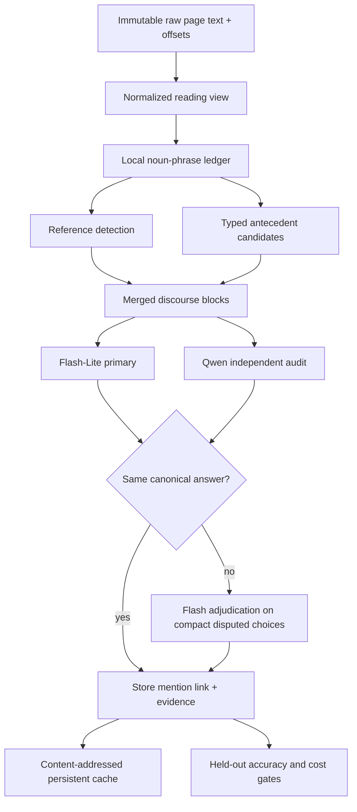

# Historical Reference Resolution

This document describes the cost-aware discourse-reference method used by the
historical-book pilots. It covers pronouns (`he`, `she`, `they`, `it`),
possessives (`his books`, `its institutions`), and repeated descriptions
(`the synagogue`, `the building`, `the school`).

The implementation is currently a private pilot, not a promoted production
resolver. Targeted regressions pass, but the required untouched held-out
precision and recall evaluation is not complete.

## 1. Why this stage exists

Fact extraction alone can produce a grounded sentence while losing its real
subject:

- `He died during an epidemic.`
- `His tomb was visited in the nineteenth century.`
- `The building retained its decorations.`
- `One of them was a synagogue.`

Without reference resolution, the graph stores anonymous people and things.
With careless resolution, it creates worse errors: a tomb may be assigned to
the last nearby person, or `Girls' Home` may be merged with `Old Age Home`.

The resolver therefore has two goals:

1. recover the antecedent when the source supports it;
2. return `ambiguous` rather than inventing an identity.

The method is generic. It does not contain rules for Efraim, a particular
synagogue, or page 301. Those examples are regression tests for general
person, thing, number, ownership, and discourse-continuity rules.

## 2. Design constraints

- Preserve immutable raw OCR offsets.
- Repair reading text before any NLP or model prompt.
- Inspect every noun phrase locally; no remote model decides what is eligible.
- Offer models only exact source candidates.
- Batch all references in a discourse block; never make one call per pronoun.
- Use independent cheap models before an expensive adjudicator.
- Cache exact model requests durably.
- Keep all book-derived outputs private.
- Fail the run when accuracy or the USD 0.002/page total cost gate fails.

## 3. End-to-end flow



The production target reuses reference decisions already produced by the page
extractor. It should call the independent resolver only for risky or disputed
chains. Running the exhaustive remote resolver as an additional stage on every
page is useful for evaluation, but too expensive on the hardest measured page.

Pages are processed in source order. After each page, a compact discourse
memory of supported subjects is written to
`ingest/corpus/restricted/extractions/<source>.discourse-memory.json`. The next
page loads it only when its recorded page is exactly the previous page; stale,
skipped, or out-of-order memory is rejected. Raw context from up to three
previous pages remains available to the constrained resolver. Thus a page-top
`the synagogue`, `He`, or `His tomb` can link to an antecedent introduced on
the preceding page without any synagogue- or person-specific rule.

## 4. Reading view and offsets

Historical OCR frequently breaks words at line boundaries:

```text
syna-
gogue
```

The reading view joins this to `synagogue` and collapses layout whitespace.
Every normalized character still maps back to its page and raw start/end
offset. Model input and browser quotes use the reading view; stored evidence
continues to use immutable raw coordinates.

This separation prevents three failures:

- the extractor seeing two fake tokens;
- search missing the full word;
- browser highlights drifting after normalization.

Implemented in:

- `cli/pilot-langextract-historical.py` for grounded extraction;
- `cli/pilot-constrained-coref.py` for the resolver;
- `cli/build-langextract-browser.mjs` for normalized display highlighting.

## 5. Local noun-phrase ledger

spaCy runs locally over the normalized text. Every noun chunk is retained as a
possible antecedent, including ordinary descriptions such as:

- `two major architectural projects`;
- `the Jewish community`;
- `Damjanich utca`;
- `a girl`;
- `R. Efraim`.

Earlier versions retained mainly names and reference phrases. That omitted
ordinary antecedents and caused models to choose an unrelated named place.
The noun-complete ledger fixes the candidate-recall problem without adding
book-specific rules.

Each mention records:

- stable source/page/raw-offset ID;
- normalized reading offsets;
- exact mention text and syntactic head;
- coarse type (`person`, `place`, or `thing`);
- singular/plural hint;
- explicit lexical gender hint when the source supplies one;
- dependency role such as subject;
- reference kind (`pronoun`, `possessive`, `definite`, or none).

Relative and speaker pronouns such as `who`, `that`, `we`, and `I` are not
antecedent entities. They are excluded from the candidate ledger.

## 6. Candidate generation

Candidate generation is deterministic and happens before any API call.

### Person references

`he`, `him`, and `his` receive person candidates. Explicitly feminine nouns
such as `a girl` cannot be offered for `he/his`; explicitly masculine nouns
cannot be offered for `she/her`.

Named people remain available across a three-previous-page discourse window. This lets a
page-opening `He` resolve to the named person introduced at the end of the
previous page.

### Singular thing references

`it` and `its` receive singular non-person candidates. Syntactic subjects are
ranked strongly. Direct objects and predicate complements also outrank a
nearby prepositional place. This handles narrative focus shifts such as
`set up the first public school in the Orczy House. It was called
Nationalschule`: `It` resolves to the school, not the house. Thus:

```text
The community ... chose spots for its institutions.
```

offers `The community` before unrelated nearby places.

### Plural references

`they`, `them`, and `their` receive plural or collective candidates. This is
what makes `One of them` consider `two major architectural projects` rather
than a singular place name.

### Definite descriptions

`the synagogue` searches earlier mentions with the same semantic head. A
modified phrase must share meaningful modifiers; final-word overlap alone is
not enough. Consequently, `Girls' Home`, `Old Age Home`, and an arbitrary
`home` are not merged merely because they end with the same noun.

At most eight candidates enter a cheap-model request. This bounds the candidate
payload for each reference. The pilot also retains an explicit
`--max-references` run-safety limit; production should process overflow in
additional batches rather than discard it.

Earlier pronouns are not offered as antecedent candidates. They caused the two
cheap models to disagree between `he` and the explicit person name, wasting a
Flash call without adding information. Links always terminate at an explicit
name or noun phrase. Known role aliases such as `the rabbi` are then mapped to
their grounded named subject.

## 7. Mentions, entities, and ownership

A mention ID identifies one exact occurrence. A canonical entity ID identifies
a provisional same-entity group. Repeated exact person names share a local
entity ID so two models choosing different occurrences of `R. Efraim` do not
create a false disagreement.

Possessive phrases require two linked meanings:

```text
His tomb
```

- the noun phrase denotes a tomb;
- `His` denotes the owner.

The resolver stores the owner link without collapsing the tomb entity into the
person. The same rule applies to `Its former students`: the students belong to
the school, but a later `them` denotes the students, not the school.

Standalone pronouns and definite descriptions may be followed through earlier
reference links to an explicit mention. Possessive noun phrases are not
collapsed this way because they introduce a distinct owned entity.

Book-level canonical identity is a later layer. Source-offset hashes are stable
mention identifiers, not global person/building identifiers. Cross-book entity
resolution uses aliases, provenance, dates, type constraints, and review.

## 8. Compact wire format

Stable hashes are expensive model tokens. Every request therefore assigns
short temporary IDs:

```text
ENTITIES:
x1|R. Efraim|p45:3912
x2|a girl|p46:454

REQUESTS:
r001|pronoun|x1,x2,?
r002|possessive|x1,x2,?
```

The source is included once. References are marked inline:

```text
... [[r001:He]] maintained ... [[r002:his books]] ...
```

Overlapping target windows are merged into continuous discourse blocks.
Distant candidates contribute only small evidence snippets. This preserves
narrative continuity without repeating 500 characters of context and eight
candidate quotes for every pronoun.

Models return only:

```text
r001|x1
r002|x1
```

The application expands temporary IDs back into stable mention/entity IDs.
Unknown IDs are rejected as `ambiguous`.

## 9. Model routing

Current pilot roles:

| Role | Model | Work |
|---|---|---|
| Primary | `google/gemini-2.5-flash-lite` | Resolve every batched reference |
| Independent audit | `qwen/qwen3-30b-a3b-instruct-2507` | Resolve the same constrained ledger independently |
| Quality adjudication | `google/gemini-2.5-flash` | Decide only genuine disagreements |

Acceptance rules:

- identical canonical answers from both cheap models are `agreed`;
- missing output is a disagreement, never an implicit `?` agreement;
- a single-model answer requires quality adjudication;
- the quality prompt normally sees the two votes, the best local candidate,
  and `?`, rather than all unrelated candidates;
- unsupported or cyclic links become `ambiguous`.

Gemini reasoning is disabled for this short ID-selection task. OpenRouter
provider routing is explicitly sorted by price. Reasoning tokens are billed as
output, so the live usage record—not a static price estimate—is authoritative.

References:

- [OpenRouter reasoning controls](https://openrouter.ai/docs/guides/best-practices/reasoning-tokens)
- [OpenRouter provider routing](https://openrouter.ai/docs/guides/routing/provider-selection)

## 10. Clause-complete omission audit

Before reference linking, an independent clause-complete omission audit checks
every target-page clause plus a real previous-page continuation. Qwen proposes
missing atomic facts. Exact copied predicates are accepted deterministically;
the strong Flash model adjudicates remaining proposals. A separate strong
boundary extraction runs only for actual word/sentence continuations, not for
adjacent captions or page numbers. Hidden context items may inform memory but
can no longer suppress a fact that was never written to target-page output.

Source-zone guards privately retain but hide bibliography, photo credit,
footer, and rejected items. OCR-normalized subject comparison deduplicates
variants such as `József` / `J6zsef` without changing raw evidence.

## 11. Caching

The pilot cache is content-addressed by:

- cache format/prompt version;
- operation role;
- model ID;
- complete compact request;
- output limit and routing parameters.

Default path:

```text
ingest/corpus/restricted/extractions/coref-pilot/.cache/model-responses.jsonl
```

This restricted-corpus path is private and ignored by Git. `--no-cache`
forces a fresh paid measurement. An identical cached replay was measured at
USD 0.000000.

Changing page text, candidate IDs, prompt rules, model, reasoning setting, or
provider routing creates a different cache key. A stale answer cannot silently
survive a semantic prompt change.

## 12. Measured results

Measurements below are fresh OpenRouter calls from 2026-07-15. Prices vary by
provider and time.

### Dedicated exhaustive resolver

| Case | References | Result | Paid cost |
|---|---:|---|---:|
| Pages 45-46, resolve page 46 | 16 | 16 resolved; both cheap models agreed | USD 0.000306 |
| Pages 300-301, resolve page 301 | 21 | 21 resolved; 8 quality adjudications | USD 0.001134 |
| Identical Efraim cache replay | 16 | 16 resolved from exact cache | USD 0.000000 |

Validated chains include:

- `He`, `his books`, and `His tomb` -> `R. Efraim`;
- `she` -> `a girl`;
- later `the synagogue` -> the earlier synagogue mention;
- `its institutions` -> the Jewish community;
- `its entire length` -> `Damjanich utca`;
- `them` -> `two major architectural projects`;
- no `Girls' Home` / `Old Age Home` or vocational-school false merge.

### Complete selective extraction pipeline

Page 301, using Qwen extraction plus the existing selective Gemini reference
fallback, produced:

- 41 valid items;
- 100% exact grounding;
- 100% compact-schema validity;
- USD 0.001394 total cost per page.

The previous equivalent measurement was USD 0.002136/page. Price-sorted
provider routing reduced it by about 35% while preserving the item count and
grounding/schema checks.

### Sequential boundary regression (pages 89-90)

The 2026-07-15 regression recovered the page-spanning school sentence and
correctly stored separate searchable facts for Szapáry's role/request,
Boráros's support, Wahrmann establishing the school, and the school being in
the Orczy House. `It was called Nationalschule` linked to the school. Page 90
then loaded 48 supported memory items from page 89 and saved memory through
page 90, proving the continuity guard is active rather than merely prompted.

Fresh total cost was USD 0.002896/page on the unusually difficult page 89 and
USD 0.002201/page on page 90 before removing page 90's false caption-boundary
escalation. The latter removal saves about USD 0.000196 on that page, bringing
its expected uncached replay to roughly USD 0.002005. These development pages
still do not prove the required average USD 0.002/page gate; the cost gate
remains failed until a representative locked evaluation passes.

Dense page 91 loaded 103 prior memory items but exposed the current hard case:
65 valid facts, 32 routed references, 93.4% clause grounding, and USD 0.004928
total cost. Local full-name/surname alias collapse reduced a focused rerun of
the reference stage from USD 0.001841 to USD 0.001528, and lone OCR tokens such
as `T` are now forbidden antecedents. This helps but does not close the dense-
page cost or grounding failure. The run must remain marked incomplete rather
than lowering quality or silently skipping references.

### Important cost boundary

API price is not charged "per pronoun." The dominant input text is shared by
all references in a page/block; additional references mainly add compact
request/output rows. Disagreements are the expensive variable because they
activate Flash adjudication.

Naively adding the exhaustive 21-reference resolver to the complete page-301
pipeline would cost approximately USD 0.002528/page and fail the USD 0.002
gate. Production must therefore reuse page-extraction decisions and remotely
audit only unresolved or risky chains. Local scanning still covers every
reference.

## 13. Commands and artifacts

From the repository root:

```bash
# Efraim boundary-context regression
talesofbudapest-backend/.venv-historical-nlp/bin/python \
  talesofbudapest-backend/cli/pilot-constrained-coref.py \
  --source jewish-budapest \
  --pages 45,46 \
  --resolve-pages 46 \
  --max-references 16 \
  --max-cost-usd .01 \
  --no-cache

# Later-page regression with required previous-page context
talesofbudapest-backend/.venv-historical-nlp/bin/python \
  talesofbudapest-backend/cli/pilot-constrained-coref.py \
  --source jewish-budapest \
  --pages 300,301 \
  --resolve-pages 301 \
  --max-references 24 \
  --max-cost-usd .01 \
  --no-cache
```

Outputs:

```text
ingest/corpus/restricted/extractions/coref-pilot/<source>/pages-*.json
ingest/corpus/restricted/extractions/<source>.langextract-pilot.report.json
ingest/corpus/restricted/extractions/<source>.discourse-memory.json
```

BookNLP comparison output remains under `booknlp-pilot/`. It is diagnostic
only: the tested model linked page-46 Efraim pronouns to Salonika, so it must
not decide production identities.

## 14. Validation still required

The method is general by construction, but two successful regression sets do
not prove general accuracy. Promotion requires the locked held-out evaluation
defined in [Historical Book Knowledge Extraction](HISTORICAL_BOOK_KNOWLEDGE_EXTRACTION.md):

- overall precision strictly above 0.95;
- overall recall strictly above 0.95;
- event and assertion slices above 0.95 when large enough;
- explicit cross-page, possessive, plural, definite-description, OCR, and
  alias slices;
- average complete API cost at most USD 0.002/source page.

Every held-out reference must be human-adjudicated, including `ambiguous` and
no-reference cases. Cached development outputs cannot become held-out gold.

## 15. Production integration plan

1. Keep the noun-complete local ledger for every page.
2. Reuse the extractor's reference vote as the first vote.
3. Send only unresolved/risky chains to the independent cheap auditor.
4. Escalate only true canonical disagreement.
5. Store mention links, owner links, evidence offsets, votes, and verdicts.
6. Run the locked held-out suite.
7. Promote the resolver only if both accuracy and total-cost gates pass.

Until step 7, pilot results remain private diagnostics and must not silently
rewrite canonical knowledge-graph identity.
