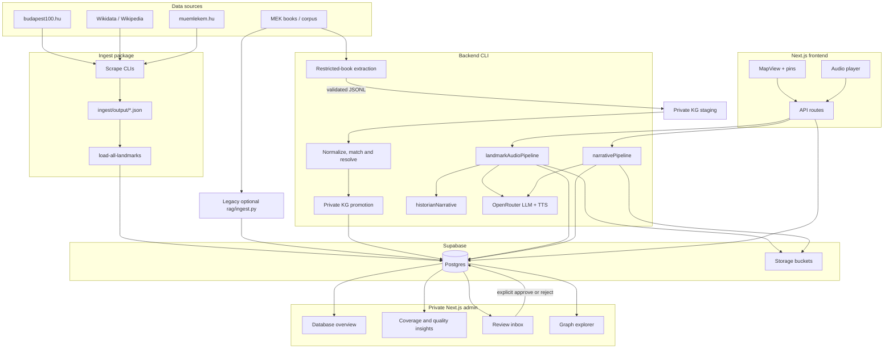

# Architecture

## High-level overview

## Packages

| Package | Runtime | Responsibility |
|---------|---------|----------------|
| `talesofbudapest-frontend` | Browser + Next.js server | Map UI, audio player, narrative questionnaire, API routes |
| `talesofbudapest-admin` | Browser + private Next.js server | Database health, KG exploration, and human review decisions |
| `talesofbudapest-backend` | Node.js CLI | Migrations, book extraction, KG matching/promotion, historian enrichment, and audio/narrative generation |
| `ingest` | Node.js CLI | Scrape external sites, transform to seeds, upsert Postgres |
| `supabase/migrations` | SQL | Schema, RLS, storage buckets, pgvector |
| `infra` | Docker | Self-hosted Supabase stack |
| `rag` | Python | Chunk + embed historical text into `document_chunks` |

## Core user flows

### 1. Browse map and play landmark audio

1. `MapView` fetches pins from `GET /api/landmarks/map` (bbox + zoom tier filter)
2. User taps a pin → `POST /api/landmarks/[id]/audio` with `locale` and `styleId`
3. API calls `landmarkAudioPipeline.js`:
   - Check `location_audio_variants` cache
   - If missing: historian narrative → spoken script → TTS → upload MP3
4. Frontend plays returned `audio_url` from Supabase Storage (`audio-tours` bucket)

### 2. Create a custom walking tour (narrative)

1. User fills questionnaire (time, vibe, topic) in `NarrativeQuestionnaire`
2. `POST /api/narratives/plan` → LLM selects landmarks, returns draft route
3. User previews on `RoutePreviewMap`, can replace stops
4. `POST /api/narratives/generate` → synthesize chapter scripts + TTS, save to `narratives` / `narrative_chapters`

### 3. Ingest landmarks

1. Scrape CLIs write JSON to `ingest/output/`
2. `load-all-landmarks` merges sources, deduplicates (priority: wikipedia > iconic > muemlekem > budapest100)
3. Upsert into `locations` + `location_translations` via Docker `psql` or direct `DATABASE_URL`

### 4. Review the knowledge graph

1. The admin server reads protected staging and canonical KG tables with a server-only service-role key.
2. The overview reports source coverage, pipeline counts, and missing migrations/tables.
3. The review inbox turns `needs_review` and pending location records into explicit questions.
4. Approve/reject writes are scoped to the reviewed record and use a current-status concurrency guard.
5. Location approval reuses the backend matcher and identity promotion rules, but never publishes new private content.

### 5. Explore staging and canonical graph data

1. `/graph?source=staging` starts from high-importance staged relations and loads their typed person, location, event, and organisation endpoints.
2. Text-only unresolved endpoints are omitted because they do not yet identify safe nodes. Consequently, the number of visible lines can be much smaller than the total staged-relation count.
3. `/graph?source=canonical` samples promoted entities, edges, and claims. The API hydrates the opposite endpoint of sampled edges so page boundaries do not make valid connections disappear.
4. The browser renders at most 120 filtered nodes. Selecting a node keeps the base layout stable and overlays its bounded ego network from the entity-detail API.
5. Network, Relations, and Ledger are three views of the same bounded response. They do not mutate or publish records.

## KG data boundaries

| Layer | Main records | Trust level | How it moves forward |
|---|---|---|---|
| Extraction files | Page/window JSONL and reports | Model output; private | Validate and load idempotently |
| Private staging | `kg_locations`, `kg_people`, `kg_events`, `kg_organisations`, `kg_facts`, `kg_staged_relations` | Extracted candidates | Resolve endpoints and review uncertainty |
| Canonical KG | `kg_entities`, `kg_entity_aliases`, `kg_claims`, `kg_edges`, `kg_evidence` | Deduplicated, still private by default | Human review and explicit publication |
| Public Chronicle | `kg_location_chronicle` / `get_location_chronicle()` | Approved, public-safe projection | Read by the visitor frontend |

Resolution, promotion, review, and publication are deliberately separate. Resolution assigns an identity; promotion creates canonical records; review approves or rejects them; publication changes the public visibility of safe records. The admin graph performs none of those merely by displaying a node.

See [Admin site](ADMIN_SITE.md) for its full data contract and safety boundary.

## Tour styles and history depth

**Tour styles** (`easy`, `storyteller`, `deep-dive`) shape tone and pacing of spoken scripts. Stored in user preferences (`tourPreferencesStore`) and passed as `styleId` to the audio API.

**History depth** (`thin`, `standard`, `rich`) is computed from source text length. Thin sources skip LLM historian enrichment and use shorter scripts.

## Frontend ↔ backend coupling

API routes import backend libs via webpack alias `@backend` → `../talesofbudapest-backend` (see `next.config.ts`). This keeps LLM/TTS logic in one place while exposing it through Next.js route handlers.

## What is not wired yet

- **RAG retrieval** — `document_chunks` and `match_document_chunks()` exist but are not called from `historianNarrative.js` or the audio pipeline
- **Cloud landmark load** — `load-all-landmarks` only supports Docker upsert; use `load-landmarks.ts` with `DATABASE_URL` for cloud
- **General relation endpoint resolution** — many staging relations still have one or two text-only endpoints, so they cannot yet be drawn or promoted as reliable canonical edges
- **Admin promotion/publication** — the graph is read-only and the Review inbox handles bounded decisions; bulk promotion and all publication remain explicit CLI operations
- **Complete review evidence** — entity inspection has safe citations, but review questions do not yet include source-title and page chips

Migrations `001` through `019` are registered in `talesofbudapest-backend/migrate.js`. The active KG schema is defined by `014_knowledge_graph_staging.sql` through `019_kg_organisations_and_placeholders.sql`.
