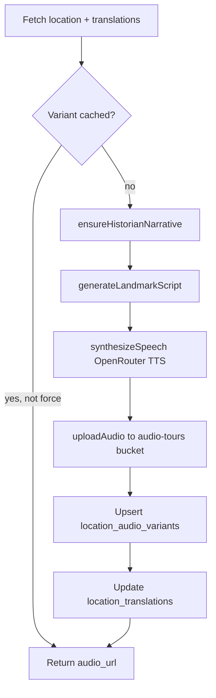

# Backend

Node.js ESM CLI package for database migrations, landmark seeding, historian enrichment, and audio/narrative generation via OpenRouter.

**Path:** `talesofbudapest-backend/`

## CLI commands

| Command | File | Purpose |
|---------|------|---------|
| `npm run seed` | `index.js` | Upsert 4 iconic landmarks (Parliament, Buda Castle, Fisherman's Bastion, St. Stephen's) |
| `npm run db:migrate` | `migrate.js` | Apply SQL migrations via `DATABASE_URL` |
| `npm run setup` | `setup.js` | migrate → seed → generate all audio |
| `npm run generate:story` | `generateStory.js` | Demo: one LLM script for Parliament |
| `npm run generate:audio` | `generateAudio.js` | TTS for one landmark (`--name`) or all (`--all`) |
| `npm run enrich:history` | `cli/enrich-history.js` | Batch historian narrative enrichment |

### enrich:history flags

```bash
npm run enrich:history -- --limit 50 --concurrency 4
npm run enrich:history -- --id <uuid> --force
```

## Library modules (`lib/`)

| Module | File | Role |
|--------|------|------|
| OpenRouter client | `openRouterClient.js` | Chat completions, TTS speech, model config |
| TTS + upload | `ttsClient.js` | PCM → MP3 (lamejs), upload to `audio-tours` bucket |
| Landmark audio | `landmarkAudioPipeline.js` | Full landmark audio pipeline (see below) |
| Historian | `historianNarrative.js` | LLM fact-only narrative from `source_material` |
| Narrative tours | `narrativePipeline.js` | Plan routes, replace stops, synthesize chapters |
| Suggestions | `suggestions.js` | Time/location contextual tour starters |
| Tour styles | `tourStyles.js` | `easy`, `storyteller`, `deep-dive` prompt templates |
| History depth | `historyDepth.js` | Word targets from source length (`thin`/`standard`/`rich`) |
| Locale | `locale.js` | Audio file suffixes: `-tour-{locale}-v2-{styleId}.mp3` |
| Supabase key | `supabaseServiceKey.js` | Resolve or sign service role JWT |
| Supabase client | `supabaseClient.js` | Shared `@supabase/supabase-js` client |

## Landmark audio pipeline

**File:** `lib/landmarkAudioPipeline.js`

Called from `generateAudio.js` and frontend `POST /api/landmarks/[id]/audio`.



### Steps in detail

1. **Read source** — `source_material` (HU facts) or fallback `story_prompt`; compute `history_depth`
2. **Historian narrative** — `historianNarrative.js` distills facts into `location_translations.historical_narrative` (skipped for `thin` depth)
3. **Script generation** — locale-aware spoken script shaped by `styleId` + topic lens from `tourStyles.js`
4. **TTS** — OpenRouter Gemini TTS (multilingual HU/EN); default model in `openRouterClient.js`
5. **Upload** — MP3 to Supabase Storage bucket `audio-tours`
6. **Cache** — row in `location_audio_variants` per `(location_id, locale, style_id)`

### Audio file naming

Pattern from `locale.js`:

```
{locationId}-tour-{locale}-v2-{styleId}.mp3
```

Example: `ece41b78-...-tour-hu-v2-storyteller.mp3`

## Historian narrative

**File:** `lib/historianNarrative.js`

- Input: `source_material` or `story_prompt`
- Output: `location_translations.historical_narrative` (HU, fact-only)
- For `thin` history depth: skips LLM, uses source text directly
- Model: `OPENROUTER_HISTORIAN_MODEL` (falls back to `OPENROUTER_MODEL`)

## Narrative pipeline

**File:** `lib/narrativePipeline.js`

Handles custom walking tours:

1. **Plan** — LLM selects landmarks from pool, orders by walkability
2. **Replace** — swap one stop while keeping route coherent
3. **Generate** — write chapter scripts + TTS, persist to `narratives` and `narrative_chapters`

## Seed script

**File:** `index.js`

Upserts 4 hardcoded iconic landmarks with images from `data/landmarkImages.js`. This is what populates a fresh Supabase cloud project with 4 rows. For the full dataset, use [Ingest](ingest.md).

## Migrations

**File:** `migrate.js`

Runs migrations from `supabase/migrations/` in order. Currently lists through `012_locations_map_index.sql`. Migration `013_location_history.sql` must be applied separately until the runner is updated. See [Database](database.md).

## Default models (env overrides)

| Variable | Purpose |
|----------|---------|
| `OPENROUTER_MODEL` | General chat |
| `OPENROUTER_HISTORIAN_MODEL` | Historian enrichment |
| `OPENROUTER_AUDIO_MODEL` | Tour script generation |
| `OPENROUTER_TTS_MODEL` | Text-to-speech (default: Gemini flash TTS) |
| `OPENROUTER_TTS_VOICE` | Voice preset |

## Related

- [Frontend](frontend.md) — API routes that call these libs
- [Database](database.md) — tables written by the pipeline
- [Environment](environment.md) — backend env vars
