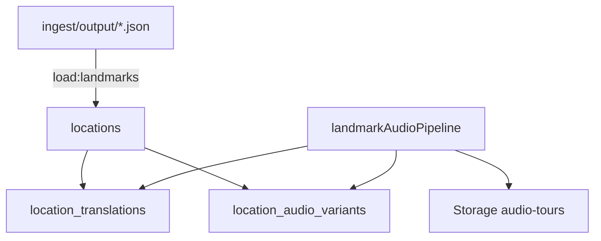

# Database

PostgreSQL schema managed by SQL migrations in `supabase/migrations/`. Used via Supabase (PostgREST + Storage) or direct `psql`.

## Local vs cloud

The project often has **two separate databases**:

| | Local Docker | Supabase cloud |
|---|-------------|----------------|
| **How to identify** | `docker exec supabase-db psql ...` | supabase.com dashboard |
| **API URL** | `http://localhost:8000` | `https://xxx.supabase.co` |
| **Typical row count** | ~433 after `load:landmarks` | ~4 after `npm run seed` only |
| **ID type** | UUID | May be integer if very old seed |
| **Data on disk** | `infra/data/postgres/` | Hosted by Supabase |

**Important:** `npm run load:landmarks` writes to **local Docker** by default. Cloud data does not update automatically.

### View local data

```bash
# Terminal
docker exec -it supabase-db psql -U postgres -d postgres

# Quick count
docker exec supabase-db psql -U postgres -d postgres \
  -c "SELECT source, count(*) FROM locations GROUP BY source;"
```

GUI: connect to `localhost:5432`, database `postgres`, user `postgres`, password from `infra/supabase-upstream/docker/.env`.

## Migrations

The complete sequence is applied by `npm run db:migrate`
(`talesofbudapest-backend/migrate.js`). `bash infra/scripts/migrate.sh` is a
partial local-Docker helper; see the note below.

| # | File | Description |
|---|------|-------------|
| 001 | `001_locations.sql` | `locations` table, public read RLS |
| 002 | `001_alter_only.sql` | Safe additive `audio_url` for existing DBs |
| 003 | `002_storage.sql` | `audio-tours` storage bucket |
| 004 | `003_locations_name_unique.sql` | Unique index on `name` |
| 005 | `004_landmark_images.sql` | `image_url`, `images` JSONB |
| 006 | `005_storage_landmark_images.sql` | `landmark-images` bucket |
| 007 | `006_narratives.sql` | `narratives`, `narrative_chapters` |
| 008 | `007_narrative_writes.sql` | Public insert policies (dev/MVP) |
| 009 | `008_rag_history.sql` | pgvector, `document_chunks`, `match_document_chunks()` |
| 010 | `009_location_provenance.sql` | `source`, `external_id`, `landmark_type` |
| 011 | `010_location_translations.sql` | Per-locale `location_translations` |
| 012 | `011_location_importance.sql` | `importance_tier`, `importance_score` |
| 013 | `012_locations_map_index.sql` | Map query index (tier, lat, lng) |
| 014 | `013_location_history.sql` | **`source_material`, `history_depth`, `historical_narrative`, `location_audio_variants`** |
| 015 | `014_knowledge_graph_staging.sql` | Private source/page/extraction staging tables |
| 016 | `015_knowledge_graph_canonical.sql` | Reviewable canonical entities, aliases, claims, edges, evidence, and public Chronicle projection |
| 017 | `016_kg_hybrid_search.sql` | Service-role-only FTS + trigram + vector search RPCs |
| 018 | `017_kg_claim_era.sql` | Claim era column, index, and initial backfill |
| 019 | `018_kg_alias_exact_match.sql` | Approved-alias exact lookup and alias provenance |
| 020 | `019_kg_organisations_and_placeholders.sql` | Staged organisations and flagged relation-endpoint placeholders |

`talesofbudapest-backend/migrate.js` lists every migration above, including
019. `infra/scripts/migrate.sh` is currently a narrower local-Docker helper
and stops after migration 014; it must not be used as evidence that a local
database has the canonical KG migrations. For the complete sequence use:

```bash
npm run db:migrate
```

Migration filenames, rather than the display numbers in this table, are the
authoritative order. There are two `001_*` files, which is why the table's
ordinal reaches 020 while the newest filename begins with `019_`.

## Core tables

### `locations`

Primary map pin table.

| Column | Type | Notes |
|--------|------|-------|
| `id` | uuid | Primary key |
| `name` | text | Unique display name |
| `latitude`, `longitude` | float | Map coordinates |
| `story_prompt` | text | Legacy summary text |
| `source_material` | text | HU raw facts (migration 013) |
| `history_depth` | text | `thin` \| `standard` \| `rich` |
| `audio_url` | text | Legacy default audio |
| `image_url` | text | Primary image |
| `images` | jsonb | Gallery `[{url, alt}]` |
| `source` | text | `budapest100` \| `muemlekem` \| `wikipedia` \| `iconic` |
| `external_id` | text | Stable source ID (slug) |
| `landmark_type` | text | `house` \| `monument` \| `building` \| `iconic` |
| `importance_tier` | text | `featured` \| `standard` \| `archive` |
| `importance_score` | integer | Numeric score for sorting |

Unique: `(source, external_id)` where both non-null.

### `location_translations`

Per-locale content. Primary key: `(location_id, locale)`.

| Column | Notes |
|--------|-------|
| `name` | Localized display name |
| `story_prompt` | Localized summary |
| `historical_narrative` | HU fact-only historian text |
| `audio_script` | Last generated spoken script |
| `audio_url` | Last generated audio |

Locales: `en`, `hu`.

### `location_audio_variants`

Per-style audio cache. Primary key: `(location_id, locale, style_id)`.

| Column | Notes |
|--------|-------|
| `style_id` | `easy` \| `storyteller` \| `deep-dive` |
| `audio_script` | Generated script for this style |
| `audio_url` | MP3 in `audio-tours` bucket |

### `narratives` / `narrative_chapters`

Custom AI walking tours.

- `narratives`: title, user_prompt, context JSONB
- `narrative_chapters`: ordered stops with lat/lng, script, audio_url, landmark_id

### RAG tables (migration 008)

| Table | Purpose |
|-------|---------|
| `historical_locations` | Named historical places for corpus |
| `historical_events` | Events linked to locations |
| `document_chunks` | Text chunks + pgvector embeddings (1536d) |

RPC: `match_document_chunks(query_embedding, match_threshold, match_count)`

**Not yet used** by the audio or narrative pipelines.

## Knowledge graph tables (migrations 014-019)

The KG has two deliberately separate layers. Loading or enriching private
staging data does not make it public.

### Private staging

| Table | Purpose |
|-------|---------|
| `kg_sources` | Source identity, URL, attribution, licence, and green/yellow/red verdict |
| `kg_pages` | Private page text and extraction status |
| `kg_mentions`, `kg_mention_pages` | Page-window model payloads, usage, and page provenance |
| `kg_locations`, `kg_people`, `kg_events`, `kg_organisations` | Source-scoped extracted entities and resolution state |
| `kg_facts` | Extracted English facts before canonical promotion |
| `kg_staged_relations` | Extracted textual relations plus optional resolved staging endpoint IDs |

Migration 019 adds `organisation` as a staged relation endpoint kind and a
`metadata` JSONB channel on staged locations, people, and events. The
placeholder CLI uses that channel for flags such as `auto_created` and
`needs_research`. A placeholder remains a source-scoped, pending staging row;
linking it to a staged relation makes that relation drawable in the private
admin graph but does not create a canonical entity or public edge.

### Canonical and public-safe

| Table/view | Purpose |
|------------|---------|
| `kg_entities` | Canonical locations, people, events, and organisations |
| `kg_entity_aliases` | Reviewed multilingual/former-name/address aliases |
| `kg_claims` | Canonical claims, including optional era and embeddings |
| `kg_edges` | Canonical entity-to-entity relations |
| `kg_evidence` | Source/page citations and reviewer-only raw excerpts |
| `kg_location_chronicle` | Narrow public projection for mapped locations |

Canonical entities, claims, and edges use `review_status` (`draft`,
`needs_review`, `approved`, `rejected`) independently from
`publication_status` (`private`, `public`). A database constraint prevents a
non-approved row from being public. The Chronicle RPC/view additionally
selects only approved, public entities, claims, and edges and never returns
raw excerpts, extraction payloads, or model metadata.

Publication is an explicit promotion action. `resolve:kg --commit` may create
an approved but **private** location identity link; it cannot publish.
`create:kg-placeholders` and `research:kg-placeholders` operate only on
staging and cannot approve or publish. `promote:kg-location --commit` creates
private `needs_review` canonical content; public promotion requires
`--publish`, and a restricted/red source also requires
`--allow-restricted-public`.

These licence controls are enforced by the supported CLI workflow, not by a
database trigger. A service-role client can write canonical tables directly,
so service credentials belong only in trusted backend/admin tooling.

## Storage buckets

| Bucket | Migration | Contents |
|--------|-----------|----------|
| `audio-tours` | 002 | Generated MP3 landmark and chapter audio |
| `landmark-images` | 005 | Uploaded landmark images (most ingest uses external URLs) |

## Landmark data layers



| Layer | What | Where |
|-------|------|-------|
| Scrape output | Raw scraped JSON | `ingest/output/` on disk |
| Loaded landmarks | Map pins + metadata | `locations` |
| Per-locale text | Names, narratives, scripts | `location_translations` |
| Per-style audio cache | MP3 per tour style | `location_audio_variants` + Storage |
| Audio files | MP3 binaries | Supabase Storage `audio-tours` |

## Syncing cloud with local

To get ~433 landmarks into Supabase cloud:

1. Apply all migrations (including 013) to cloud `DATABASE_URL`
2. Set `DATABASE_URL` to cloud pooler URI
3. Run `ingest/src/cli/load-landmarks.ts` with combined seeds, or extend `load-all-landmarks` to support `DATABASE_URL`
4. Point app env at cloud `SUPABASE_URL`

## Related

- [Ingest](ingest.md) — how data gets into `locations`
- [Infrastructure](infra.md) — local Docker Postgres
- [RAG](rag.md) — `document_chunks` ingest
