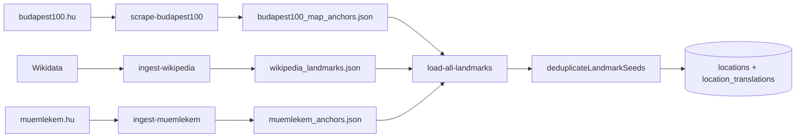

# Ingest

TypeScript package that scrapes external landmark sources, transforms them into seeds, and upserts into Postgres.

**Path:** `ingest/`

## Data sources

| Source | Website | CLI | Output JSON |
|--------|---------|-----|-------------|
| Budapest100 | [budapest100.hu](https://budapest100.hu) | `scrape-budapest100.ts` | `output/budapest100_map_anchors.json` |
| Wikipedia / Wikidata | Curated Q-IDs | `ingest-wikipedia.ts` | `output/wikipedia_landmarks.json` |
| Műemlékem | [muemlekem.hu](https://muemlekem.hu) | `ingest-muemlekem.ts` | `output/muemlekem_anchors.json` |
| Wikidata open-data poll | Wikidata Query Service | `poll-open-wikidata.ts` | `output/open/wikidata_budapest_offset_*.json` |
| Commons open-media poll | Wikimedia Commons | `poll-open-commons.ts` | `output/open/commons_*.json` |
| MEK / OSZK corpus | Hungarian Electronic Library | `fetch-mek.ts` | `corpus/mek/raw/` + `corpus/mek/manifest.json` |

JSON files are gitignored (`ingest/output/*.json`) and generated at runtime.

## Commands

From repo root:

```bash
npm run scrape:budapest100
npm run ingest:wikipedia
npm run ingest:muemlekem
npm run load:landmarks
npm run poll:open-wikidata -- --limit 250
npm run poll:open-commons -- --category Budapest --limit 100
npm run fetch:mek
```

### poll:open-wikidata

Polls the Wikidata Query Service for entities with coordinates within 15 km of
central Budapest. Every output record is explicitly labelled **CC0-1.0** with
the Wikidata licensing page as evidence. It is discovery-only: it does not
download Wikipedia prose or Commons files, which carry separate licences.

```bash
npm run poll:open-wikidata -- --dry-run
npm run poll:open-wikidata -- --limit 250 --offset 250
npm run poll:open-wikidata -- --modified-since 2026-07-01
```

Use the offset form for the initial backfill. Afterwards, use the
`--modified-since` form for incremental polling. Keep the output files as the
source manifest until the R2/`kg_sources` plumbing is in place.

### poll:open-commons

Polls a Wikimedia Commons category and retains files only when their own API
metadata explicitly reports Public Domain, CC0, CC BY, or CC BY-SA. The output
keeps the file page, original URL, licence evidence, creator, and pagination
token; individual file metadata remains the authority for reuse.

```bash
npm run poll:open-commons -- --category Budapest --limit 100
npm run poll:open-commons -- --category "History of Budapest" --continue "..."
```

### fetch:mek

Downloads only the manually reviewed, green-licensed Budapest-history PDFs in
`src/sources/mek/books.ts`. Originals are kept outside Git under
`ingest/corpus/mek/raw/`; the accompanying manifest stores the original URL,
SHA-256, fetch date, licence, attribution, and licence-evidence URL.

```bash
npm run fetch:mek -- --dry-run
npm run fetch:mek -- --book MEK-15124
```

The initial allowlist contains MEK-15124 (*Budapest képes lexicona*, public
domain) and MEK-17520 (Lux Terka's *Budapest*, CC BY-SA 4.0). Add titles only
after recording an item-level licence verdict; downloads deliberately pause two
seconds between requests. Set `MEK_USER_AGENT` to a project user-agent that
includes the project email before scheduled production polling.

From `ingest/`:

```bash
npm run scrape
npm run ingest:wikipedia
npm run ingest:muemlekem
npm run load
npm run backfill:importance
```

### scrape:budapest100 flags

```bash
npm run scrape:budapest100 -- --seed csalogany-utca-55 --max-pages 10
npm run scrape:budapest100 -- --geocode --fortepan --min-tier standard
npm run scrape:budapest100 -- --sitemap-seeds 100 --append
```

| Flag | Default | Purpose |
|------|---------|---------|
| `--seed` | `csalogany-utca-55` | Starting slug(s) for crawl |
| `--max-pages` | 10 | Max pages to crawl |
| `--geocode` | off | Geocode addresses via Nominatim |
| `--fortepan` | off | Fetch Fortepan historical photos |
| `--min-tier` | standard | Skip below this importance tier |
| `--sitemap-seeds` | 0 | Bootstrap from sitemap |
| `--append` | off | Append to existing JSON |
| `--output` | `output/budapest100_map_anchors.json` | Output path |

### ingest:muemlekem flags

```bash
npm run ingest:muemlekem -- --city Budapest --max-items 500 --geocode
```

### load:landmarks

Merges all three JSON sources, deduplicates, upserts to Postgres.

```bash
npm run load:landmarks -- --dry-run
npm run load:landmarks -- --min-tier standard
```

**Default target:** local Docker via `docker exec supabase-db psql` (`upsertLandmarkDocker`).

For cloud Postgres, use `load-landmarks.ts` with `DATABASE_URL` set (single-file loader supports PG and Supabase REST).

## Data flow



## Deduplication priority

When the same building appears in multiple sources (`dedupLandmarks.ts`):

1. `wikipedia` (highest)
2. `iconic`
3. `muemlekem`
4. `budapest100` (lowest)

Dedup report written to `output/dedup_report.json`.

## Transform: scrape → seed

**Mapper:** `src/mappers/toLandmarkSeed.ts`

| Seed field | Source |
|------------|--------|
| `name` | Budapest100 page title / address |
| `external_id` | URL slug (e.g. `andrassy-ut-49`) |
| `lat`, `lng` | Geocoded coordinates |
| `story_prompt` | EN-ish: year + architect + historical stories |
| `source_material` | HU: same facts in Hungarian |
| `history_depth` | `thin` / `standard` / `rich` from text length |
| `importance_tier` | `featured` / `standard` / `archive` / `skip` |
| `image_url`, `images` | Budapest100 + optional Fortepan URLs |
| `translations` | HU + EN name and story_prompt |

## Upsert paths

| Module | When used |
|--------|-----------|
| `upsertLandmarkDocker.ts` | Default for `load-all-landmarks` — `docker exec psql` |
| `upsertLandmarkPg.ts` | When `DATABASE_URL` is set in `load-landmarks.ts` |
| `upsertLandmark.ts` | When only `SUPABASE_URL` + key available (REST API) |

## Typical dataset sizes

| Stage | Count (approx.) |
|-------|-----------------|
| Budapest100 scraped (JSON) | ~2,400 houses |
| After `--min-tier standard` load | ~329 budapest100 |
| muemlekem loaded | ~79 |
| wikipedia loaded | ~25 |
| **Total in local DB** | **~433** |

## backfill:importance

Recomputes `importance_tier` and `importance_score` on existing DB rows from anchor JSON files. Uses Docker `psql` by default.

## Key types

**File:** `src/types/landmark.ts`

```typescript
type LandmarkSource = 'budapest100' | 'muemlekem' | 'wikipedia' | 'iconic'
type ImportanceTier = 'featured' | 'standard' | 'archive' | 'skip'
type HistoryDepth = 'thin' | 'standard' | 'rich'
```

**File:** `src/types/mapAnchor.ts` — raw Budapest100 scrape shape (`historicalStories`, `fortepanImageUrls`, etc.)

## Related

- [Database](database.md) — where loaded data lands
- [Architecture](architecture.md) — full system flow
